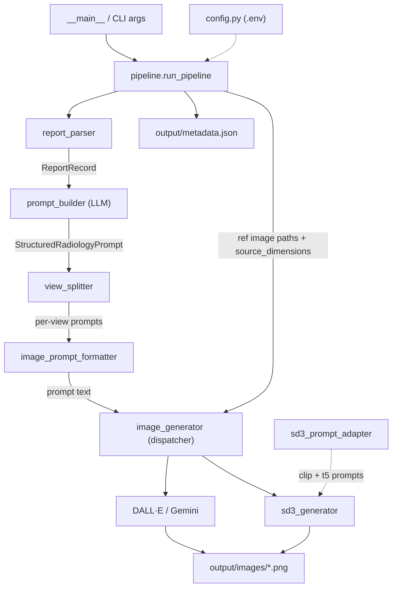

# ARCHITECTURE

Reference for extending this repository. Everything below reflects the current code in `pipeline/`.

## 1. Project Overview

**What it does:** A batch CLI pipeline that turns real radiology reports (the Indiana Chest X-ray dataset) into *synthetic* chest X-ray images. Each CSV report is sent to an LLM to extract a structured clinical description, that structure is rendered into a long text prompt, and the prompt (optionally with the original X-ray as a visual reference) is sent to an image-generation API. Output is PNG images plus a `metadata.json` manifest.

**Technologies:**
- Python 3, `pandas` (CSV), `pydantic` v2 (data contracts), `Pillow` (image I/O), `tqdm` (progress), `python-dotenv` (config).
- LangChain (`langchain-core`, `langchain-openai`, `langchain-google-genai`, `langchain-google-vertexai`) for structured LLM extraction.
- Image generation: OpenAI DALL·E 3 (`openai`), Google Gemini image models via `google-genai` / Vertex AI, or **Stable Diffusion 3 running locally** via `diffusers` + `torch`.

**How it fits together:** One orchestrator (`pipeline/pipeline.py`) drives a linear chain of single-purpose, stateless modules. Modules never call each other sideways — they are pure-ish functions composed by the orchestrator, communicating through two Pydantic models in `pipeline/models.py`.

## 2. Repository Structure

```text
synth-dataset-pipeline/
├── pipeline/
│   ├── __main__.py               # `python -m pipeline` entry → pipeline.main()
│   ├── pipeline.py               # Orchestrator + argparse CLI (run_pipeline, main)
│   ├── config.py                 # .env loading, API keys, model ids, paths, ratio tables
│   ├── models.py                 # Pydantic contracts: ReportRecord, StructuredRadiologyPrompt, ImageProjection
│   ├── report_parser.py          # CSV → ReportRecord[]  (load_reports, load_projections)
│   ├── prompt_builder.py         # ReportRecord → StructuredRadiologyPrompt (LLM call)
│   ├── view_splitter.py          # Splits multi-view reports into per-view prompts
│   ├── image_prompt_formatter.py # StructuredRadiologyPrompt → final prompt text
│   ├── image_generator.py        # Prompt → PNG via DALL·E/Gemini/SD3 (+ aspect-ratio helpers)
│   ├── sd3_prompt_adapter.py     # Long prompt → (clip_prompt, t5_prompt) + negative prompt
│   └── sd3_generator.py          # Prompt → PNG via local Stable Diffusion 3 (txt2img/img2img)
├── indiana_reports.csv           # Input: reports (uid, findings, impression, image, MeSH, ...)
├── indiana_projections.csv       # Optional input: uid → filename + projection (reference images)
├── test_pipeline.py              # Smoke script: imports + prompt formatting, no API calls
├── test_aspect_ratio.py          # Unit checks for compute_best_aspect_ratio
├── test_sd3.py                   # SD3 checks: buckets, prompt split, mode resolution, dispatch
├── synth-dataset-notebook.ipynb  # Kaggle runner (Gemini): clone, install, secrets, `python -m pipeline`
├── sd3-kaggle-notebook.ipynb     # Kaggle GPU runner for SD3, both modes
├── .env.example                  # Config template (no secrets committed)
├── requirements.txt
├── requirements-sd3.txt          # torch/diffusers, kept out of the base requirements
└── output/                       # Generated (gitignored): images/*.png + metadata.json
```

`ChestXray_Indiana_university.ipynb` and the two PDFs are exploratory/reference material, not part of the runtime.

## 3. Architecture

Stages are strictly sequential per report; the orchestrator owns all control flow, error handling, and I/O.

```text
indiana_reports.csv (+ indiana_projections.csv, images_dir)
    ↓  report_parser.load_reports / load_projections
ReportRecord
    ↓  prompt_builder.extract_structured_prompt   → Vertex/Gemini, OpenAI, or custom endpoint
StructuredRadiologyPrompt
    ↓  view_splitter.split_prompt_by_views        → [(view, prompt), ...]
    ↓  image_prompt_formatter.format_image_prompt → final prompt string
    ↓  image_generator.generate_image             → DALL·E 3, Gemini image API, or local SD3
output/images/<uid>[_<view>].png  +  output/metadata.json
```



## 4. Modules

| Module | Responsibility |
|---|---|
| **config** (`pipeline/config.py`) | Loads `../.env` via `dotenv`, exposes keys/model ids/paths as module constants, detects Kaggle (`IS_KAGGLE`), holds `GEMINI_SUPPORTED_ASPECT_RATIOS` / `DALLE_SUPPORTED_SIZES` / `SD3_SUPPORTED_DIMENSIONS`, and creates `IMAGES_DIR` at import. Depends on nothing internal; imported by everything else. |
| **models** (`pipeline/models.py`) | The shared contracts. `ReportRecord` (a CSV row, CSV-cased aliases `MeSH`/`Problems` with `populate_by_name`), `ImageProjection` (filename + projection), `StructuredRadiologyPrompt` (the LLM's structured-output schema). Depends on nothing internal. |
| **report_parser** (`pipeline/report_parser.py`) | `load_reports()` reads the CSV, fills NaN, **drops rows where both `findings` and `impression` are empty**, then applies `offset` then `limit`, and attaches `reference_images` from the optional `load_projections()` lookup (`uid → list[ImageProjection]`). Depends on `pandas`, `models`. |
| **prompt_builder** (`pipeline/prompt_builder.py`) | Turns a `ReportRecord` into a `StructuredRadiologyPrompt`. Two paths: the LangChain path (`build_prompt_chain()` → `ChatPromptTemplate \| llm.with_structured_output(...)`) selecting Vertex/Gemini vs OpenAI via `_is_vertex_model(CHAT_MODEL)`, and a custom Vertex endpoint path (`extract_structured_prompt_endpoint`) used when `VERTEX_ENDPOINT_ID` is set, which parses raw JSON out of the text with `_extract_json_from_text`. `extract_structured_prompt()` is the unified entry point. Heavy SDK imports are **inside** the branches. |
| **view_splitter** (`pipeline/view_splitter.py`) | `split_prompt_by_views(prompt, raw_image_text)` returns `[(view_name, prompt), ...]`. Detects a frontal (`PA`/`AP`/`Frontal`) **and** a lateral marker via regex — checks the raw CSV `image` column first, then falls back to `plane_view`. Multi-view → one deep-copied prompt per view with `view` set and `modality` simplified; otherwise `[(None, original_prompt)]`. Pure functions, no I/O. |
| **image_prompt_formatter** (`pipeline/image_prompt_formatter.py`) | `format_image_prompt(sp) -> str` builds bracketed sections joined by blank lines: `[REFERENCE IMAGES]`, `[MODALITY CONDITIONING]`, `[SINGLE VIEW DIRECTIVE]`, `[IMAGE GEOMETRY]`, `[ANATOMICAL PROMPTING]`, `[METADATA CONDITIONING]`, `[TEXTUAL PROMPTING — CLINICAL DESCRIPTION]`, `[ANATOMICAL CONSTRAINTS]`, `[IMAGING CHARACTERISTICS]`, `[NEGATIVE CONSTRAINTS — STRICT]`. Optional sections are omitted when their source field is `None`; the last three always emit. Pure function. |
| **image_generator** (`pipeline/image_generator.py`) | `generate_image(...)` dispatches on `"dalle"` / `"gemini"` / `"sd3"` to `generate_image_dalle` / `generate_image_gemini` / `generate_image_sd3`; unknown names raise `ValueError`. Both back-ends retry 3× with exponential backoff (`2**attempt`), save a PNG via Pillow, and return its `Path`. `compute_best_aspect_ratio(w, h)` picks the nearest ratio string by absolute difference. |
| **sd3_prompt_adapter** (`pipeline/sd3_prompt_adapter.py`) | `split_prompt_for_sd3(text, sp) -> (clip_prompt, t5_prompt)` reshapes the long formatted prompt for SD3's three text encoders: a ≤60-word visual summary for CLIP-L/CLIP-G (which truncate at 77 tokens) and the full structured text for T5. `build_negative_prompt(extra)` restates the `[NEGATIVE CONSTRAINTS]` prose as comma-separated noun phrases for SD3's real negative channel. Pure functions, no I/O. |
| **sd3_generator** (`pipeline/sd3_generator.py`) | `generate_image_sd3(...)` runs SD3 locally in `txt2img` or `img2img` mode. `load_sd3_pipeline(mode)` caches the multi-GB pipeline in a module-level dict; the img2img class is bound with `from_pipe` so both modes share one set of weights. `compute_sd3_dimensions(w, h)` picks the nearest ~1MP bucket, `_resolve_mode(...)` downgrades img2img→txt2img when a record has no reference image, `_load_init_image(...)` prepares the init latent. |
| **pipeline** (`pipeline/pipeline.py`) | Orchestrator. Builds the LLM chain **once** and reuses it, loops records with `tqdm`, resolves reference-image paths and reads source dimensions with Pillow, calls each stage, catches per-record exceptions into `error_prompt` / `error_image` keys so one bad report never aborts the run, and writes `metadata.json`. Preloads the SD3 pipeline before the loop when `generator="sd3"`, and validates img2img config up front. Also exposes `run_from_prompts()`, which replays prompts from an existing metadata JSON and skips the CSV load and LLM entirely — it needs no LLM credentials, so extraction can run on CPU and only generation on a GPU. Defines the argparse CLI in `main()`. |

**Conventions all stage modules follow:** module docstring at top; `from __future__ import annotations` (every module except `config.py`, `__init__.py`, `__main__.py`); relative imports (`from .models import ...`); typed signatures; private helpers prefixed `_`; provider SDK imports deferred into the function that uses them; no module reads `os.environ` directly — only `config` does.

## 5. Image Generation Flow

1. `pipeline.main()` parses CLI args → `run_pipeline()` ([pipeline.py:28](pipeline/pipeline.py#L28)).
2. `load_projections()` + `load_reports()` produce `ReportRecord`s with `reference_images` populated.
3. Per record: `extract_structured_prompt(record, chain=chain)` → `StructuredRadiologyPrompt`; the orchestrator then copies `record.reference_images` onto it.
4. `split_prompt_by_views(structured, record.image)` yields one or more `(view, prompt)` pairs.
5. If `--images-dir` was given, the orchestrator resolves each `proj.filename` under it, skips missing files with a warning, opens the first survivor with Pillow to get `(width, height)`, and derives `matched_ratio` via `compute_best_aspect_ratio`.
6. Per view: `format_image_prompt(view_prompt)` → prompt text, then `generate_image(prompt, uid, generator=gen, image_paths=..., view_suffix=view_name, source_dimensions=...)`.
7. **Gemini path** (`generate_image_gemini`): builds a `genai.Client` (`vertexai=True` with project/`GCP_IMAGE_LOCATION`, or plain `api_key` on Kaggle); reference images become `Part.from_bytes` entries **prepended before** `Part.from_text(prompt)`; `source_dimensions` become `ImageConfig(aspect_ratio=...)`; config uses `response_modalities=["TEXT", "IMAGE"]`. The response is scanned for the first part with `inline_data`, which is saved as PNG.
   **DALL·E path** (`generate_image_dalle`): reference images are unsupported and ignored with a warning; size comes from `_best_dalle_size(...)` when dimensions are known, else `config.DALLE_IMAGE_SIZE`; requested as `b64_json` and decoded.
   **SD3 path** (`generate_image_sd3`): resolves the effective mode, maps `source_dimensions` to a `SD3_SUPPORTED_DIMENSIONS` bucket, splits the prompt into `prompt`/`prompt_2` (CLIP) and `prompt_3` (T5) via `sd3_prompt_adapter`, and calls the cached pipeline. `txt2img` passes `height`/`width`; `img2img` passes the resized reference X-ray as `image=` plus `strength`, and omits `height`/`width` because the img2img class takes geometry from the init image. The pipeline is preloaded by the orchestrator before the record loop.
8. Files land at `output/images/<uid>.png`, or `<uid>_<view>.png` when a view suffix is present. Paths and prompts are recorded in `entry["views"]`, and all entries are dumped to `output/metadata.json`.

**Metadata shape** (per report): `uid`, `structured_prompt` (a `model_dump` excluding `reference_images` and `view`), optional `reference_images`, `source_dimensions`, `matched_aspect_ratio`, `error_prompt`, and `views: [{view, image_prompt, image_path | error_image}]`.

## 6. Configuration

All configuration lives in **`pipeline/config.py`**, which loads a `.env` from the project root. `.env` is gitignored; `.env.example` is the committed template. Never hardcode keys, and never read `os.getenv` outside `config.py`.

- **Keys:** `OPENAI_API_KEY`, `GOOGLE_API_KEY`.
- **Vertex/GCP:** `GCP_PROJECT_ID`, `GCP_LOCATION` (default `us-central1`), `GCP_IMAGE_LOCATION` (default `global`), `VERTEX_ENDPOINT_ID` (setting this switches prompt extraction to the custom-endpoint path).
- **Models:** `CHAT_MODEL` (default `gpt-4.1-mini`), `IMAGE_GENERATOR` (`dalle`|`gemini`|`sd3`, default `sd3`), `GEMINI_IMAGE_MODEL`, `DALLE_MODEL`, `DALLE_IMAGE_SIZE`, `DALLE_IMAGE_QUALITY`.
- **SD3:** `HUGGINGFACE_TOKEN`, `SD3_MODEL_ID`, `SD3_MODE` (`txt2img`|`img2img`), `SD3_STEPS`, `SD3_GUIDANCE_SCALE`, `SD3_HEIGHT`/`SD3_WIDTH`, `SD3_IMG2IMG_STRENGTH`, `SD3_DTYPE`, `SD3_NEGATIVE_PROMPT`, `SD3_SEED`, `SD3_MAX_SEQUENCE_LENGTH`, `SD3_ENABLE_CPU_OFFLOAD`, `SD3_ENABLE_VAE_SLICING`, `SD3_DROP_T5`.
- **Paths:** `PROJECT_ROOT`, `OUTPUT_DIR`, `IMAGES_DIR`, `METADATA_FILE`.
- **`IS_KAGGLE`** is derived from `KAGGLE_KERNEL_RUN_TYPE`. On Kaggle both the chat and image clients switch to plain API-key auth, because Kaggle's `kaggle_gcp.py` causes a circular import with `google.cloud.aiplatform`. Any new Google-SDK code must honor this branch.

CLI flags (`--generator`, `--limit`, `--offset`, `--csv`, `--projections-csv`, `--images-dir`, `--skip-images`, `--sd3-mode`, `--sd3-strength`, `--sd3-steps`, `--sd3-guidance`, `--sd3-seed`, `--sd3-model-id`, `--output-subdir`, `--prompts-from`, `--resume`, `--num-shards`, `--shard-index`) override config at call time; the pattern is `value = arg or config.DEFAULT`. The SD3 scalar flags are applied by mutating `config.*` in `main()` before `run_pipeline` is called.

**`--output-subdir NAME`** redirects `config.IMAGES_DIR` to `output/images/<NAME>/` and `config.METADATA_FILE` to `output/metadata_<NAME>.json`. Because the filename contract is `<uid>.png` regardless of backend or settings, two runs over the same uids (txt2img vs img2img, or a parameter sweep) would otherwise overwrite each other.

**`--num-shards N --shard-index I`** (both required together, `_apply_shard` in `pipeline.py`) restrict the loaded reports/entries to `uid % N == I`, for splitting one CSV across multiple GPU processes — e.g. Kaggle's "GPU T4 x2" accelerator, launched via `CUDA_VISIBLE_DEVICES=0`/`1` with a distinct `--output-subdir` per shard. Assignment is by `uid % N`, not a list slice, so it's stable regardless of load order and each shard's `--resume` only ever sees its own uids. `merge_shards.py <name1> <name2> ...` combines the shards' `metadata_<name>.json` files and image directories back into one `metadata.json`/`images/` (or another `--output-subdir` target), sorted by uid. No changes were needed in `sd3_generator.py` for this — `_select_device` already resolves to whichever GPU the process's `CUDA_VISIBLE_DEVICES` makes visible.

## 7. How to Add a New Module

Use **`view_splitter.py`** as the template — it is the newest stage and the clearest example: one file, pure functions, private regex/helpers prefixed `_`, one public entry point, no I/O, wired in by the orchestrator.

**Steps (example: adding a `quality_filter` stage that drops or flags low-quality prompts):**

1. **Create the file** at `pipeline/<module_name>.py`. No subpackages — the package is intentionally flat.
2. **Write it in house style:** module docstring explaining the stage, `from __future__ import annotations`, relative imports of `models`/`config` only, typed signature, private helpers prefixed with `_`, one public function as the entry point.
3. **Communicate through the existing models.** Accept and return `ReportRecord` or `StructuredRadiologyPrompt` from `pipeline/models.py` rather than inventing a parallel dict format. If your stage needs a new field, add it to `StructuredRadiologyPrompt` — but see the schema rule in §8 and use `PrivateAttr` + property for any non-LLM runtime metadata (follow `_source_dimensions`).
4. **Add any settings to `config.py`**, reading them with `os.getenv("NAME", "<default>")` and documenting them in `.env.example`. Do not read the environment from your module.
5. **Register it in the orchestrator** — this is the only wiring point. Import it at the top of `pipeline/pipeline.py` (`from .quality_filter import filter_prompt`), then call it inside the per-record loop at the correct position in the chain, wrapped so a failure degrades gracefully:
   ```python
   try:
       structured = filter_prompt(structured)
   except Exception as e:
       tqdm.write(f"  ⚠ quality_filter failed for uid={record.uid}: {e}")
   ```
   Use `tqdm.write(...)` rather than `print(...)` for per-record messages inside the loop so the progress bar is not corrupted.
6. **Expose a CLI flag** in `main()` via `parser.add_argument(...)`, thread it through `run_pipeline()`'s signature as a keyword argument with a `None`/`False` default, and pass it down. Keep new parameters optional so existing invocations and the Kaggle notebook keep working.
7. **Record results in metadata:** add your keys to the per-record `entry` dict (or to a `view_entry` for per-view data) so they reach `metadata.json`. Return a value from your function; do not mutate global state.
8. **Calling the image API:** never call OpenAI/Gemini/diffusers SDKs directly from a new module. Route through `image_generator.generate_image(prompt, uid, generator=..., image_paths=..., view_suffix=..., source_dimensions=..., structured_prompt=..., sd3_mode=...)`, which returns a `Path`. To add a *new image back-end*, write `generate_image_<name>(...)` mirroring the existing signature (prompt, uid, view_suffix, source_dimensions, `max_retries=3` with `2**attempt` backoff, save PNG to `config.IMAGES_DIR`, return the `Path`), add a branch to the `generate_image` dispatcher, and extend the `--generator` argparse `choices` list. A *small* back-end lives in `image_generator.py` alongside DALL·E and Gemini; one that needs its own state, helpers, or heavy dependencies gets its own module and the dispatcher branch stays a two-line delegation — `sd3_generator.py` is the worked example.
9. **Add a smoke check** in the style of `test_pipeline.py` (import + assert on output, no API calls) or `test_aspect_ratio.py` (table of cases). These are plain scripts run with `python test_pipeline.py`, not pytest.

## 8. Important Rules / Constraints

- **`StructuredRadiologyPrompt` is a live LLM schema.** It is passed to `llm.with_structured_output()`, so every public field becomes part of the Vertex AI function declaration. **Vertex AI rejects tuple-backed fields** — this is why `source_dimensions` and `matched_aspect_ratio` are `PrivateAttr` with property accessors (see the commit that fixed this). Any new runtime-only metadata must follow that same private-attr pattern; only genuinely LLM-extracted fields belong as public `Optional[...]` fields with a `description`.
- **Private attrs do not survive `model_dump()`** and are not in `metadata.json`'s `structured_prompt`; the orchestrator writes `source_dimensions`/`matched_aspect_ratio` at the top level of the entry separately.
- **Stage order in `run_pipeline` matters.** `split_prompt_by_views` deep-copies the prompt *before* the orchestrator assigns `source_dimensions`, so split multi-view prompts carry `None` there and their text omits the `[IMAGE GEOMETRY]` section (true single-view reports return the same object and do keep it). Image geometry is still correct in both cases because `generate_image` receives `source_dimensions` as an explicit argument. If you move or re-copy prompts, preserve this — and if you intend split views to include the geometry section, the dimension assignment must move above the split.
- **Per-record isolation:** the fallible stages in the loop are wrapped in `try/except` — LLM extraction (records `error_prompt` and `continue`s), Pillow dimension reading (warns and proceeds), and image generation (records `error_image` per view). The pure stages (`split_prompt_by_views`, `format_image_prompt`) are deliberately unguarded because they do no I/O. Any new stage that touches the network or filesystem must be wrapped the same way — a single bad report must never abort a long batch.
- **The chain is built once** (`build_prompt_chain()` before the loop) and reused. Don't construct LLM clients inside the per-record loop.
- **Local models are cached and preloaded, never constructed per image.** SD3 is a multi-gigabyte object taking 30–90s to reach the GPU. `load_sd3_pipeline(mode)` memoises into `_PIPELINE_CACHE`, and `run_pipeline` calls it *before* the `tqdm` loop so the load is not charged to the first record and the ETA stays honest. Any future local model must follow this. The img2img pipeline is bound with `StableDiffusion3Img2ImgPipeline.from_pipe(txt2img_pipe)`, which rebinds the same transformer/VAE/text-encoders — calling `from_pretrained` twice would double both the download and VRAM use.
- **SD3's CLIP encoders truncate at 77 tokens.** The formatted prompt is 400–500 tokens, so passing it directly means CLIP sees only the leading boilerplate and never the clinical findings. Always route long prompts through `sd3_prompt_adapter.split_prompt_for_sd3`, which yields a short CLIP prompt (`prompt`/`prompt_2`) and the full text for T5 (`prompt_3`). Prohibitions belong in `negative_prompt`, not the positive prompt — stating them positively summons what they forbid.
- **`img2img` degrades, it does not fail.** `_resolve_mode` returns `txt2img` when a record has no reference image, because many Indiana uids have no projection file on disk. A single missing PNG must never abort a batch. Always record the *effective* mode returned by `_resolve_mode` in metadata, not the requested one, or a mixed run becomes indistinguishable from a pure one afterwards. `height`/`width` are invalid on the img2img pipeline — geometry comes from the init image, which `_load_init_image` resizes to the same bucket.
- **`build_prompt_chain()` returns `None`** when `VERTEX_ENDPOINT_ID` is set; `extract_structured_prompt()` ignores the chain on that path. Any code that assumes a non-`None` chain will break custom-endpoint runs.
- **Kaggle branch:** anything touching Google SDKs needs the `config.IS_KAGGLE` fallback to API-key auth, or Kaggle runs hit a circular import.
- **Defer provider SDK imports** into functions (`from openai import OpenAI`, `from google import genai`, `from langchain_openai import ChatOpenAI`, `import torch` / `from diffusers import ...`). Top-level imports would make the package unimportable when only one provider's dependencies are installed — `test_pipeline.py` relies on this, and `test_sd3.py` asserts it explicitly by checking `torch`/`diffusers` are absent from `sys.modules` after importing `sd3_generator`. `torch` is a multi-GB dependency kept in `requirements-sd3.txt`, not `requirements.txt`.
- **`config.py` has no `from __future__ import annotations`,** so its module-level variable annotations are evaluated at runtime. Use `Optional[int]`, not `int | None` — the latter needs Python 3.10+ and breaks on 3.9. PEP 585 generics (`dict[str, float]`, `tuple[int, int]`) are fine.
- **Prompt-format invariants:** sections are `[UPPERCASE NAME]\n<body>` joined by `\n\n`; `test_pipeline.py` asserts on `[MODALITY CONDITIONING]`, `[ANATOMICAL PROMPTING]`, and `[TEXTUAL PROMPTING`. **`impression` is deliberately excluded** from the image prompt so it is not rendered as text in the image, and `[NEGATIVE CONSTRAINTS — STRICT]` exists to suppress any text/annotation overlays — do not add report text to the prompt without weighing this.
- **Reference images reach Gemini as multimodal input and SD3 as the img2img init latent.** DALL·E, and SD3 in `txt2img` mode, ignore `image_paths` with a warning. `--images-dir` also requires `--projections-csv`, or reference images are silently disabled.
- **Filename contract:** `<uid>.png` or `<uid>_<view>.png` in `config.IMAGES_DIR`. Downstream notebook cells and `metadata.json` consumers depend on it.
- **Aspect ratios** come from the tables in `config.py`; extend those dicts rather than hardcoding ratio strings. DALL·E 3 supports only its three sizes. SD3 uses `SD3_SUPPORTED_DIMENSIONS`, which maps a ratio to explicit `(width, height)` rather than a ratio string — every bucket is ~1MP with both sides a multiple of 16, as the VAE (factor 8) and patch size (2) require. `compute_sd3_dimensions` reuses `compute_best_aspect_ratio` over a derived `{key: w/h}` view, so there is one ratio-matching implementation across all three back-ends.
- **Input CSV coupling:** `report_parser` expects the columns `uid, MeSH, Problems, image, indication, comparison, findings, impression`, and `indiana_projections.csv` expects `uid, filename, projection`. The `image` column is also the primary signal for view detection.
- Keep `output/` gitignored, and never commit `.env`, service-account JSON, or generated data.
